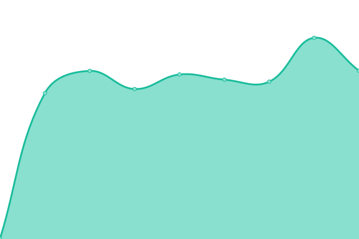

# [📈 Live Status](https://cos-repo.github.io/upptime1): <!--live status--> **🟧 Partial outage**

This repository contains the open-source uptime monitor and status page for [cos-repo](https://cos-repo.github.io/upptime1), powered by [Upptime](https://github.com/upptime/upptime).

With [Upptime](https://upptime.js.org), you can get your own unlimited and free uptime monitor and status page, powered entirely by a GitHub repository. We use [Issues](https://github.com/cos-repo/upptime1/issues) as incident reports, [Actions](https://github.com/cos-repo/upptime1/actions) as uptime monitors, and [Pages](https://cos-repo.github.io/upptime1) for the status page.

<!--start: status pages-->
<!-- This summary is generated by Upptime (https://github.com/upptime/upptime) -->
<!-- Do not edit this manually, your changes will be overwritten -->
<!-- prettier-ignore -->
| URL | Status | History | Response Time | Uptime |
| --- | ------ | ------- | ------------- | ------ |
|  [CosGrid](https://cosgrid.com) | 🟩 Up | [cos-grid.yml](https://github.com/cos-repo/upptime1/commits/HEAD/history/cos-grid.yml) | 

 1394ms
     
 | 

<a href="https://uptime.cosgrid.com/history/cos-grid">100.00%</a>
    

|  [wwwCosgrid](https://www.cosgrid.com) | 🟩 Up | [www-cosgrid.yml](https://github.com/cos-repo/upptime1/commits/HEAD/history/www-cosgrid.yml) | 

 1400ms
     
 | 

<a href="https://uptime.cosgrid.com/history/www-cosgrid">100.00%</a>
    

|  [CosGrid Networks](https://cosgrid.net) | 🟩 Up | [cos-grid-networks.yml](https://github.com/cos-repo/upptime1/commits/HEAD/history/cos-grid-networks.yml) | 

 938ms
     
 | 

<a href="https://uptime.cosgrid.com/history/cos-grid-networks">100.00%</a>
    

|  [wwwCosGrid Networks](https://www.cosgrid.net) | 🟥 Down | [www-cos-grid-networks.yml](https://github.com/cos-repo/upptime1/commits/HEAD/history/www-cos-grid-networks.yml) | 

 0ms
     
 | 

<a href="https://uptime.cosgrid.com/history/www-cos-grid-networks">0.00%</a>
    

|  [Google](https://www.google.com) | 🟩 Up | [google.yml](https://github.com/cos-repo/upptime1/commits/HEAD/history/google.yml) | 

 93ms
     
 | 

<a href="https://uptime.cosgrid.com/history/google">100.00%</a>
    

|  [Backend API](https://cosgridnetworks.in/api/v1/tenant/data/cosgrid-com-mail/) | 🟩 Up | [backend-api.yml](https://github.com/cos-repo/upptime1/commits/HEAD/history/backend-api.yml) | 

 922ms
     
 | 

<a href="https://uptime.cosgrid.com/history/backend-api">99.10%</a>
    

<!--end: status pages-->

[**Visit our status website →**](https://cos-repo.github.io/upptime1)

## 📄 License

- Powered by: [Upptime](https://github.com/upptime/upptime)
- Code: [MIT](./LICENSE) © [cos-repo](https://cos-repo.github.io/upptime1)
- Data in the `./history` directory: [Open Database License](https://opendatacommons.org/licenses/odbl/1-0/)
